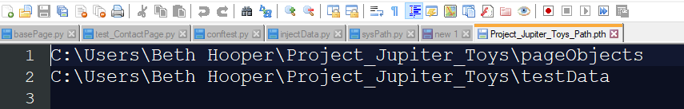
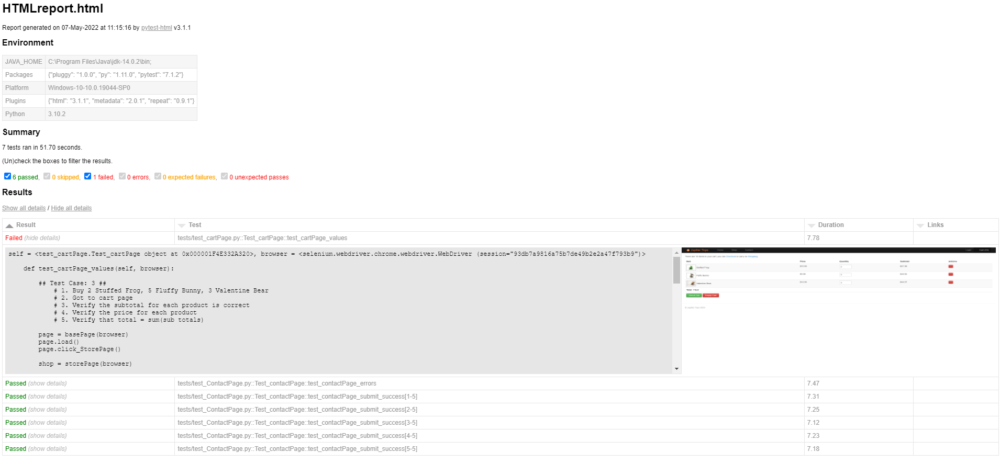

# Project: Plannit Testing Technical Exam
## Project Description 
The cotents of this git repo are used to test the functionality of https://jupiter.cloud.planittesting.com/ 

### NOTE: Troubleshooting 
### Issue: modules not found 
Please ensure that the pageObjects folder and testData folder are in PYTHONPATH. this can be done by navigating to 

C:\\Users\\...\\AppData\\Local\\Programs\\Python\\Python310\\Lib\\site-packages

adding a .pth file to this folder with the paths to pageObject and testData 



restart the project and run it again, the project should run now.

## Required modules 

pipenv, 
Python 3.10,
Selenium 4.1.3, 
webdriver-manager 3.5.4,
pytest-html 3.1.1, 
 
### Current Browsers Supported 
- Chrome 
- Firefox 

## Install pipenv
pipenv was used to manage dependencies and create a virtual environment to run the testing framework. 

```
pip install pipenv 
```

## Setting up environment 
Once pipenv is install you are required to install the dependencies using the following line of code 
```
pipenv install --dev 
```
to see that all dependencies have been installed input the follow 
```
pipenv graph 
```
to spawn a shell with the virtualenv activated 
```
pipenv shell
```

with this the environment to run the tests should be set up. 

## Run Testing framework 

```
pytest -v tests --html=HTMLreport.html --self-contained-html
```

### HTML test reports 
once all tests have concluded a html report will be created detailing tests ran, duration, pass/fail and screenshot on failure. 




